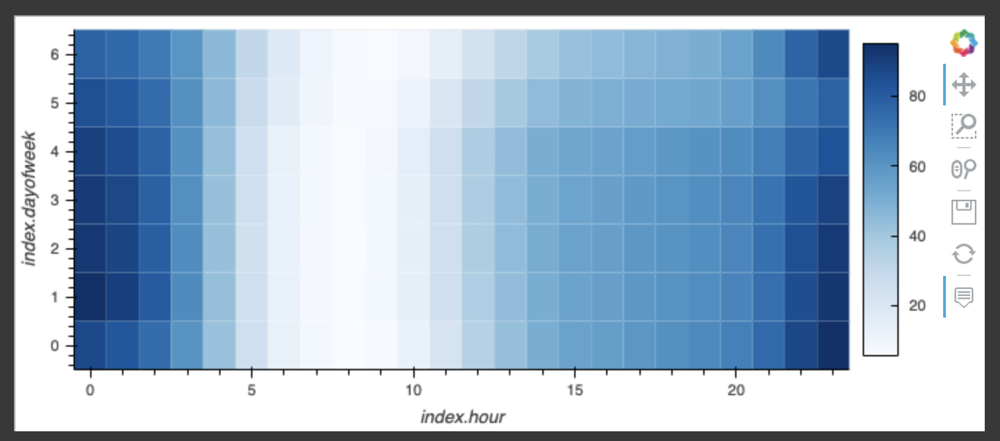
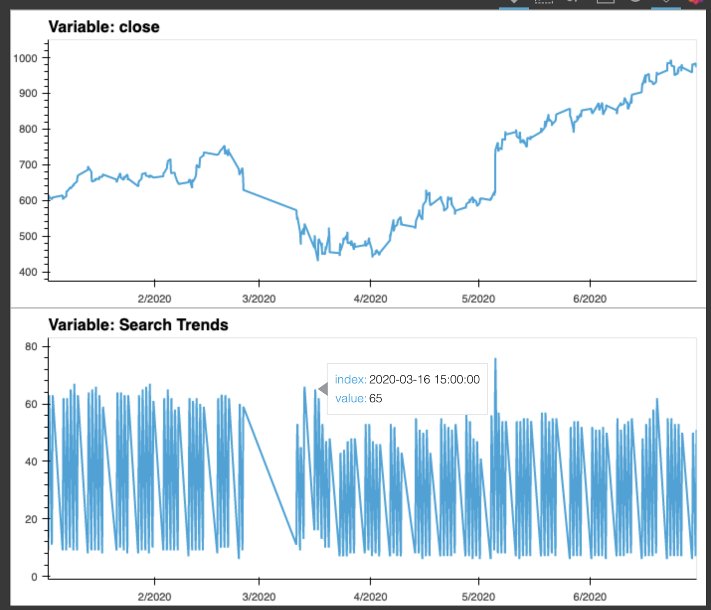
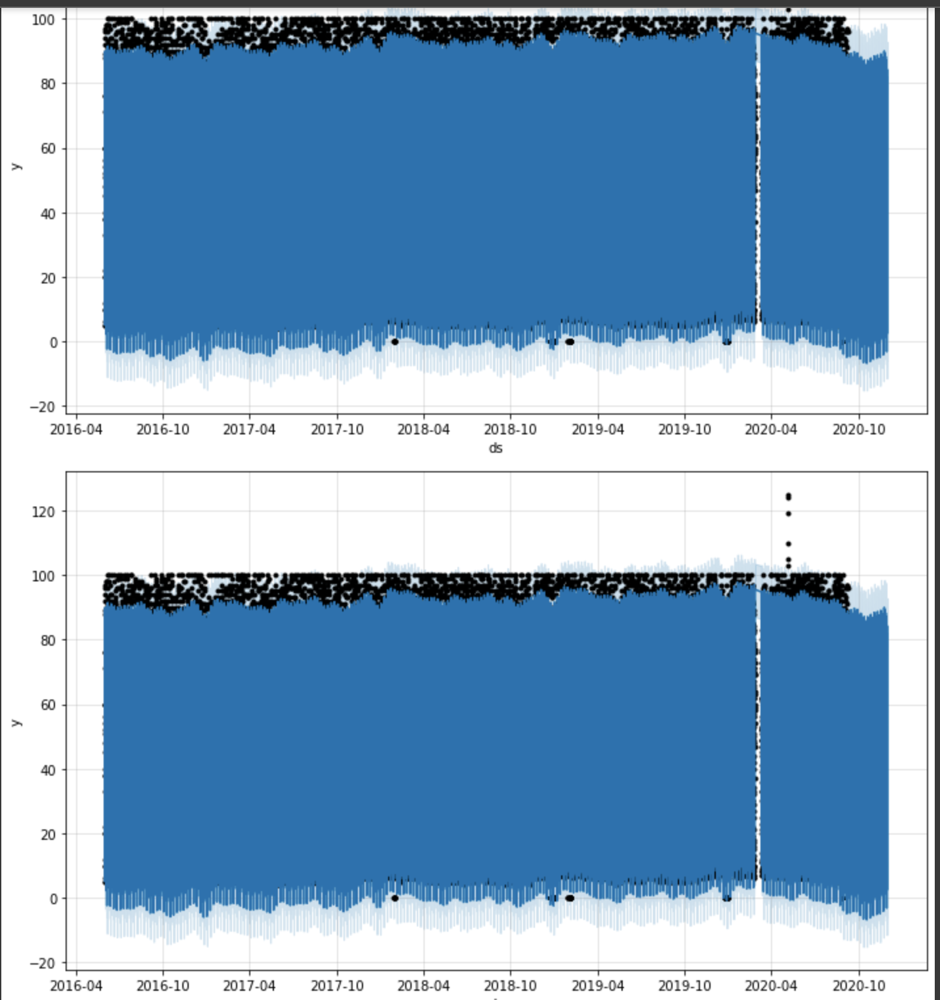

# Google Colab and MercadoLibre

As a growth analyst at MercadoLibre, which has 200 million users, I was tasked with with analyzing the company's financial and user data in clever ways to make the company grow. So, you want to find out if the ability to predict search traffic can translate into the ability to successfully trade the stock.

A Jupyter notebook needs to be created to include the data preparation, analysis, and visualizations for all the time series data that the company needs to understand.

## Technologies

The Jupyter notebook created for this project is being executed from Google Colab: https://colab.research.google.com/. 

## Installation Guide

The following libraries are installed:

* !pip install pystan

* !pip install prophet

* !pip install hvplot

* !pip install holoviews

The following libraries are imported:

* import pandas as pd

* import holoviews as hv

* from prophet import Prophet

* import hvplot.pandas

* import datetime as dt

* %matplotlib inline

* import numpy as np

## Usage

Below are some screenshots of the visualizations produced. 

